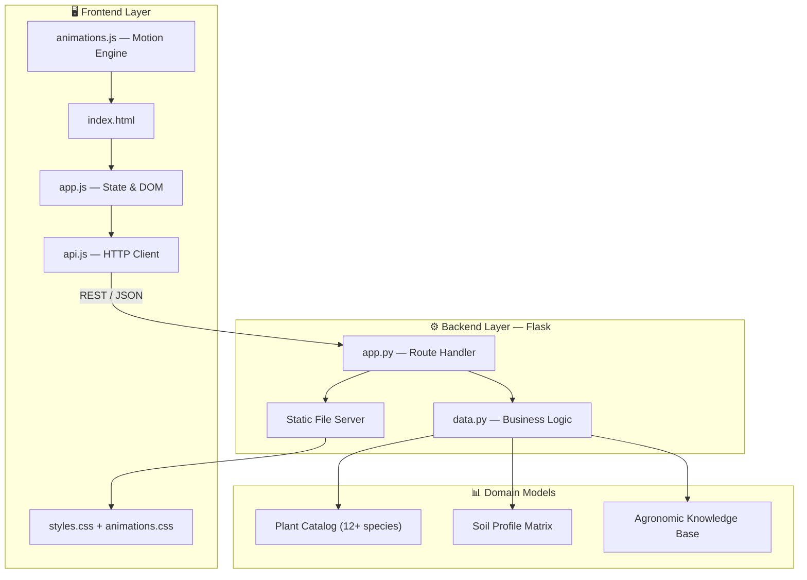

<div align="center">

```
   ███████╗██╗  ██╗██╗   ██╗███████╗ █████╗ ██████╗ ███╗   ███╗
   ██╔════╝██║ ██╔╝╚██╗ ██╔╝██╔════╝██╔══██╗██╔══██╗████╗ ████║
   ███████╗█████╔╝  ╚████╔╝ █████╗  ███████║██████╔╝██╔████╔██║
   ╚════██║██╔═██╗   ╚██╔╝  ██╔══╝  ██╔══██║██╔══██╗██║╚██╔╝██║
   ███████║██║  ██╗   ██║   ██║     ██║  ██║██║  ██║██║ ╚═╝ ██║
   ╚══════╝╚═╝  ╚═╝   ╚═╝   ╚═╝     ╚═╝  ╚═╝╚═╝  ╚═╝╚═╝     ╚═╝
              S O L U T I O N S  ·  v1.0
```

### Intelligent Urban Garden Planning Engine

*Full-stack web platform for spatial garden design, plant-soil matching, and agronomic decision support.*

<br/>

[](https://python.org)
[](https://flask.palletsprojects.com)
[](https://developer.mozilla.org/en-US/docs/Web/JavaScript)
[](https://developer.mozilla.org/en-US/docs/Web/HTML)
[](https://developer.mozilla.org/en-US/docs/Web/CSS)
[](https://github.com/Varsha-salimath/skyfarm-solutions)

[](https://github.com/Varsha-salimath/skyfarm-solutions)
[](https://github.com/Varsha-salimath/skyfarm-solutions)
[](https://github.com/Varsha-salimath/skyfarm-solutions/pulls)

**[Local Setup](#-local-setup-guide)** · **[API Reference](#-api-reference)** · **[Architecture](#-system-architecture)** · **[Report Bug](https://github.com/Varsha-salimath/skyfarm-solutions/issues)**

</div>

---

## 🧠 Overview

**SkyFarm Solutions** is a production-grade gardening intelligence platform that transforms raw environmental inputs — *space dimensions, photoperiod, soil composition, and seasonality* — into actionable planting strategies.

Built on a **decoupled client-server architecture**, the system exposes a RESTful JSON API consumed by a lightweight vanilla JS frontend with GPU-accelerated motion design and full accessibility compliance.

> *Engineered for urban farmers, rooftop gardeners, and agri-tech enthusiasts who need data-driven decisions — not guesswork.*

---

## ⚡ Core Modules

<table>
<tr>
<td width="50%">

### 📏 Space Planning Engine
Computes optimal plant density across three layout algorithms:
- **Row planting** — traditional bed configuration
- **Square-foot grid** — intensive urban cultivation
- **Container garden** — balcony / rooftop mode

</td>
<td width="50%">

### 🌼 Recommendation System
Multi-parameter filtering engine matching plants against:
- Sunlight exposure (`full` · `partial` · `shade`)
- Growing season (`spring` → `winter`)
- Soil taxonomy (`loamy` · `sandy` · `clay` · `silty`)

</td>
</tr>
<tr>
<td>

### 🧪 Soil Compatibility Analyzer
Cross-references plant profiles against soil types. Returns graded verdicts (`good` · `fair` · `poor`) with amendment protocols.

</td>
<td>

### 🪴 Knowledge Base
Categorized agronomic tips with dynamic filtering — watering, fertilizing, plant care, and seasonal operations.

</td>
</tr>
<tr>
<td colspan="2" align="center">

### 🐛 Disease Detection `COMING SOON`
Computer-vision pipeline for leaf symptom analysis and treatment recommendation. *Currently on roadmap.*

</td>
</tr>
</table>

---

## 🏗 System Architecture



```
┌─────────────────────────────────────────────────────────────┐
│  Browser                                                    │
│  ┌─────────────┐   fetch()    ┌──────────────────────────┐  │
│  │  Frontend   │ ──────────►  │  Flask API  :5000        │  │
│  │  (Vanilla)  │ ◄──────────  │  + Static Asset Server   │  │
│  └─────────────┘   JSON       └──────────────────────────┘  │
│         │                              │                    │
│         ▼                              ▼                    │
│  IntersectionObserver            data.py Logic Layer        │
│  requestAnimationFrame           Input Validation           │
│  CSS transform/opacity           Error Handling (4xx)       │
└─────────────────────────────────────────────────────────────┘
```

---

## 🛠 Tech Stack

| Layer | Stack | Engineering Notes |
|-------|-------|-------------------|
| **Presentation** | HTML5 · CSS3 · Vanilla JS | Zero framework overhead · Sub-50KB JS payload |
| **Motion System** | CSS Keyframes + `requestAnimationFrame` | GPU-composited transforms · 60 FPS target |
| **API Client** | Native `fetch` + async/await | Centralized error handling in `api.js` |
| **Application Server** | Python 3 · Flask 3.x | Unified static + API serving |
| **Cross-Origin** | Flask-CORS | Dev-ready CORS middleware |
| **Data Layer** | Python dicts / in-memory | Modular — swappable for PostgreSQL / SQLite |
| **Design** | Figma · Canva | UI/UX prototyping pipeline |

---

## 🚀 Local Setup Guide

Follow these steps to clone, configure, and run SkyFarm Solutions on your machine.

### Prerequisites

Make sure the following are installed before you begin:

| Tool | Minimum Version | Check Command | Download |
|------|-----------------|---------------|----------|
| **Git** | any recent | `git --version` | [git-scm.com](https://git-scm.com) |
| **Python** | 3.8+ | `python --version` | [python.org](https://python.org) |
| **pip** | bundled with Python | `pip --version` | — |
| **Web Browser** | any modern browser | — | Chrome · Firefox · Edge |

---

### Step 1 — Clone the Repository

Open a terminal (**Command Prompt**, **PowerShell**, or **Git Bash** on Windows · **Terminal** on Mac/Linux) and run:

```bash
git clone https://github.com/Varsha-salimath/skyfarm-solutions.git
```

This downloads the full project into a folder named `skyfarm-solutions`.

---

### Step 2 — Navigate to the Project

```bash
cd skyfarm-solutions
```

Your folder structure should look like this:

```
skyfarm-solutions/
├── frontend/       ← UI (HTML, CSS, JS)
├── backend/        ← Flask API server
└── README.md
```

---

### Step 3 — Create a Virtual Environment *(recommended)*

Isolates project dependencies from your system Python.

**Windows (PowerShell / CMD):**
```bash
cd backend
python -m venv venv
venv\Scripts\activate
```

**Mac / Linux:**
```bash
cd backend
python3 -m venv venv
source venv/bin/activate
```

You should see `(venv)` appear at the start of your terminal prompt.

---

### Step 4 — Install Dependencies

With the virtual environment active and inside the `backend/` folder:

```bash
pip install -r requirements.txt
```

Expected output:
```
Successfully installed flask flask-cors werkzeug ...
```

---

### Step 5 — Start the Server

Still inside `backend/`:

```bash
python app.py
```

You should see:
```
 * Running on http://127.0.0.1:5000
 * Running on http://0.0.0.0:5000
```

> Keep this terminal window open while using the app. Closing it stops the server.

---

### Step 6 — Access the App in Your Browser

Open any browser and go to:

| URL | What it opens |
|-----|---------------|
| **http://localhost:5000** | Main SkyFarm web app |
| **http://127.0.0.1:5000** | Same app (alternate address) |
| **http://localhost:5000/api/health** | API health check (JSON) |

You should see the SkyFarm homepage with Space Planner, Plant Finder, Soil Checker, and Tips sections.

---

### Step 7 — Verify Everything Works

Run this in a **new terminal** (leave the server running in the first one):

```bash
curl http://localhost:5000/api/health
```

Expected response:
```json
{ "status": "ok", "app": "SkyFarm Solutions" }
```

Or simply open **http://localhost:5000/api/health** in your browser.

---

### Quick Reference — Full Setup (One Block)

<details>
<summary><b>⚡ Copy-paste full setup (Windows)</b></summary>

```bash
git clone https://github.com/Varsha-salimath/skyfarm-solutions.git
cd skyfarm-solutions\backend
python -m venv venv
venv\Scripts\activate
pip install -r requirements.txt
python app.py
```

Then open → **http://localhost:5000**

</details>

<details>
<summary><b>⚡ Copy-paste full setup (Mac / Linux)</b></summary>

```bash
git clone https://github.com/Varsha-salimath/skyfarm-solutions.git
cd skyfarm-solutions/backend
python3 -m venv venv
source venv/bin/activate
pip install -r requirements.txt
python app.py
```

Then open → **http://localhost:5000**

</details>

---

### Stopping the Server

In the terminal where the server is running, press:

```
Ctrl + C
```

---

### Troubleshooting

| Problem | Solution |
|---------|----------|
| `python: command not found` | Use `python3` instead, or [install Python](https://python.org) and check **"Add to PATH"** during install |
| `pip install` fails | Run `python -m pip install --upgrade pip` then retry |
| Port `5000` already in use | Stop the other process, or change port in `backend/app.py` → `app.run(port=5001)` |
| Page not loading | Confirm terminal shows `Running on http://127.0.0.1:5000` and no errors |
| `git clone` asks for login | Repo is public — use HTTPS URL above; no login needed for read access |
| Virtual env won't activate (Windows) | Run `Set-ExecutionPolicy -Scope CurrentUser RemoteSigned` in PowerShell, then retry |

---

<details>
<summary><b>🔧 Dependency Versions</b></summary>

| Package | Version |
|---------|---------|
| Python | `≥ 3.8` |
| Flask | `≥ 3.0` |
| flask-cors | `≥ 4.0` |

</details>

---

## 📡 API Reference

Base URL: `http://localhost:5000`

<details open>
<summary><b>GET /api/health</b> — Service heartbeat</summary>

```bash
curl http://localhost:5000/api/health
```

```json
{ "status": "ok", "app": "SkyFarm Solutions" }
```

</details>

<details>
<summary><b>GET /api/plants</b> — Full plant catalog</summary>

```bash
curl http://localhost:5000/api/plants
```

</details>

<details>
<summary><b>POST /api/plants/recommend</b> — Filtered recommendations</summary>

```bash
curl -X POST http://localhost:5000/api/plants/recommend \
  -H "Content-Type: application/json" \
  -d '{"sunlight":"full","season":"summer","soil":"loamy"}'
```

```json
{
  "plants": [{ "id": "tomato", "name": "Tomato", "emoji": "🍅", "care": "..." }],
  "count": 4
}
```

</details>

<details>
<summary><b>POST /api/space/calculate</b> — Spatial layout computation</summary>

```bash
curl -X POST http://localhost:5000/api/space/calculate \
  -H "Content-Type: application/json" \
  -d '{"length":10,"width":6,"layout":"rows"}'
```

```json
{
  "summary": "Your 10×6 ft garden (60 sq ft) can support approximately 20 plants.",
  "area": 60,
  "plants_estimate": 20,
  "suggestions": ["Create 3 planting rows...", "..."]
}
```

</details>

<details>
<summary><b>POST /api/soil/check</b> — Soil-plant compatibility</summary>

```bash
curl -X POST http://localhost:5000/api/soil/check \
  -H "Content-Type: application/json" \
  -d '{"plant":"tomato","soil":"clay"}'
```

```json
{
  "verdict": "△ Clay soil can work for Tomato with amendments.",
  "status": "fair",
  "advice": "Mix in sand and organic matter for better drainage."
}
```

</details>

<details>
<summary><b>GET /api/tips?category=</b> — Agronomic knowledge retrieval</summary>

```bash
curl "http://localhost:5000/api/tips?category=watering"
```

```json
{ "tips": [{ "category": "watering", "title": "...", "body": "..." }] }
```

</details>

---

## 📂 Repository Structure

```
skyfarm-solutions/
│
├── frontend/                    # Client application
│   ├── index.html               # SPA shell
│   ├── css/
│   │   ├── styles.css           # Design system & layout
│   │   └── animations.css       # Motion design layer
│   └── js/
│       ├── api.js               # REST client abstraction
│       ├── app.js               # Application controller
│       └── animations.js        # Scroll · parallax · particles
│
├── backend/                     # Server application
│   ├── app.py                   # Flask routes + static serving
│   ├── data.py                  # Domain logic & data models
│   └── requirements.txt         # Python dependencies
│
└── README.md
```

---

## 🔬 Engineering Highlights

| Capability | Implementation |
|------------|----------------|
| **Separation of Concerns** | API client · UI logic · animation engine · server routes · business rules — fully decoupled |
| **Input Validation** | Server-side type checking, bounds validation, HTTP `400`/`404` error contracts |
| **Progressive Enhancement** | App functional without JS animations; degrades gracefully |
| **Accessibility** | `prefers-reduced-motion` kills all decorative motion · `aria-hidden` on ambient layers |
| **Performance** | `will-change` + `translate3d` compositing · passive scroll listeners · `requestAnimationFrame` parallax |
| **Scroll UX** | `IntersectionObserver` reveal system with staggered child animations |
| **Scalability Path** | `data.py` → database ORM · Flask → Gunicorn + Nginx · static → CDN |

---

## 🗺 Roadmap

```
[✓] REST API architecture          [✓] Multi-layout space engine
[✓] Plant recommendation engine    [✓] Soil compatibility matrix
[✓] GPU motion design system         [ ] PostgreSQL persistence layer
[ ] JWT auth + user garden profiles  [ ] CV disease detection pipeline
[ ] OpenWeather API integration      [ ] Docker + CI/CD deployment
```

---

## 👩‍💻 Author

<div align="center">

**Varsha Salimath**

[](https://github.com/Varsha-salimath)

*Built with precision. Grown with purpose.*

</div>

---

<div align="center">

**SkyFarm Solutions** © 2026 · Open Source · Educational & Personal Use

⭐ Star this repo if it helped you grow smarter.

</div>
